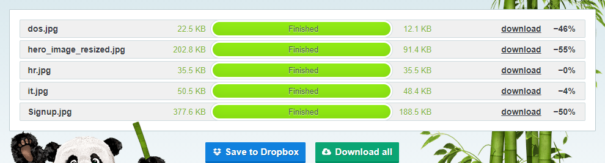

<h1 align="center">L.E.A.R.N</h1> 
<h2 align="center">Learning English Aligned to Real Needs</h2>
The scope for this project is to create a responsive and accessible website for a ficional school called L.E.A.R.N (Learning English Aligned to Real Needs).
  
L.E.A.R.N provides custom English learning courses that align to the real needs of Professionals looking to learn English as a foreign language in their chosen career.
  

## User Experience (UX)

-   ### User stories

    -   #### First Time Visitor Goals
        1. As a First Time Visitor, I want to easily understand the main purpose of the site and learn more about the school.
        2. As a First Time Visitor, I want to be able to easily navigate throughout the site and to contact the support team for more information.
        3. As a First Time Visitor, I want to be able to find their social media links easily.

    -   #### Returning Visitor Goals
        1. As a Returning Visitor, I want to find information about new courses and deals.
        2. As a Returning Visitor, I want to find the best / easiest way to get in contact with them with any query.

    -   #### Frequent User Goals
        1. As a Frequent User, I want to check to see if there are any newly added courses or events.
        2. As a Frequent User, I want to check to see if there are any holidays or closures coming up.
        3. As a Frequent User, I want to be able to download the Student handbook if I need to.

<h1>Design</h1>

## Strategy Plane
While adult english schools in Ireland provide a strict and structured curriculum for students to learn english as a foreign language they often fail to provide the students with the english that is unique to their professional needs and the local english speaking population.

The objective of this project is to give the user the ability to find and sign-up to a course that is aligned to their professional needs.

## Scope Plane
This project will look to provide the ficitous company/school L.E.A.R.N Ltd. a company website.

The website will convey the uniqiness of the services provided to the prospective student and a means to contact the school or sign-up to a course.

## Structure Plane
As the aim of the site is to provide courses and information to the users the site was developed to be a linear multi-page site. The User has access to a navbar at the top of the page which they can use to navigate to any page on the website.

It was also planned to have contact information and access to social media on all pages for ease of use.

## Skeleton Plane
From the structure above I was able to generate the below Wireframes for the site, while these wireframes are guidelines for building the main structure of the site the layout of the content is subject to change.

### Wireframes

-   #### Balsamiq - [View](https://github.com/KevAndrews/Milestone_Project_1/blob/main/wireframes/Milestone_project_1.bmpr)

-   #### Desktop
    1.  Home Page Wireframe - [View](https://github.com/KevAndrews/Milestone_Project_1/blob/main/wireframes/desktop/Home%20Page%20Desktop%20Version.png)
    
    2.  Courses Page Wireframe - [View](https://github.com/KevAndrews/Milestone_Project_1/blob/main/wireframes/desktop/Courses%20Page%20Desktop%20Version.png)
    
    3.  Contact Us Page Wireframe - [View](https://github.com/KevAndrews/Milestone_Project_1/blob/main/wireframes/desktop/Contact_Sign%20Up%20Page%20Desktop%20Version.png)
    
    4.  About Us Page Wireframe - [View](https://github.com/KevAndrews/Milestone_Project_1/blob/main/wireframes/desktop/About%20Us%20Page%20Desktop%20Version.png)

-   #### Tablet
    1.  Home Page Wireframe - [View](https://github.com/KevAndrews/Milestone_Project_1/blob/main/wireframes/tablet/Home%20Page%20Tablet%20Version.png)

    2.  Courses Page Wireframe - [View](https://github.com/KevAndrews/Milestone_Project_1/blob/main/wireframes/tablet/Courses%20Page%20Tablet%20Version.png)

    3.  Contact Us Page Wireframe - [View](https://github.com/KevAndrews/Milestone_Project_1/blob/main/wireframes/tablet/Contact_Sign%20Up%20Page%20Tablet%20Version.png)

    4.  About Us Page Wireframe - [View](https://github.com/KevAndrews/Milestone_Project_1/blob/main/wireframes/tablet/About%20Us%20Page%20Tablet%20Version.png)

-   #### Mobile

    1.  Home Page Wireframe - [View](https://github.com/KevAndrews/Milestone_Project_1/blob/main/wireframes/mobile/Home%20Page%20Mobile%20Version.png)

    2.  Courses Page Wireframe - [View](https://github.com/KevAndrews/Milestone_Project_1/blob/main/wireframes/mobile/Courses%20Page%20Mobile%20Version.png)
    
    3.  Contact Us Page Wireframe - [View](https://github.com/KevAndrews/Milestone_Project_1/blob/main/wireframes/mobile/Contact_Sign%20Up%20Page%20Mobile%20Version.png)
    
    4.  About Us Page Wireframe - [View](https://github.com/KevAndrews/Milestone_Project_1/blob/main/wireframes/mobile/About%20Us%20Page%20Mobile%20Version.png)

## Surface Plane

-   ### Design
    -   #### Colour Scheme
        The colour scheme I used for the site were taken from the Irish flag I deicided to used this colour scheme to give the site a different look from other school site, the Hex values I used are:

        -   #169B62 - For Green
        -   #f3f3ee - For White
        -   #FF883E - For Orange

        These values were taken from [schemecolor](https://www.schemecolor.com/ireland-flag-colors.php). I deicided to use a different white so it would be easier on the eyes.

    -   #### Typography
        -   I deicided on using Google Fonts Lexend and Roboto throughout the site to have a clean and clear font face.
    -   #### Imagery
        -   The hero image and backgroud image on the main page and Contact Us page are from unsplash [Photographer Javier Trueba](https://unsplash.com/@javotrueba?utm_source=unsplash&amp;utm_medium=referral&amp;utm_content=creditCopyText) and I used this [Hero Image](https://unsplash.com/photos/iQPr1XkF5F0) and [Sign Up Image](https://unsplash.com/photos/y1GTwSUMRUc).
        -   The HR image are from unsplash [Photographer Christina @ wocintechchat.com](https://unsplash.com/@wocintechchat?utm_source=unsplash&utm_medium=referral&utm_content=creditCopyText) and I used this [HR Image](https://unsplash.com/photos/0Zx1bDv5BNY).

    

## Features

-   Responsive on all device sizes.

-   Navbar will collapse to a Burger Menu on small displays.

-   The Subtitle will disappear on small displays.

-   The Home page provide a clear mission statment to the end user and the imagry and sub-headings convey a clear educational environment.

-   The Courses Page conveys a brief description of the course and a call to action.

-   The Contact Us Page has a user friendly form and a clear call to action.

-   The About Us Page conveys the background of the school and a short introduction to the Heads of department.

## Technologies Used

### Languages Used

-   [HTML5](https://en.wikipedia.org/wiki/HTML5)
-   [CSS3](https://en.wikipedia.org/wiki/Cascading_Style_Sheets)

### Frameworks, Libraries & Programs Used

1. [Bootstrap 4.5.2:](https://getbootstrap.com/docs/4.5/getting-started/introduction/)
    - Bootstrap was used to assist with the responsiveness and styling of the website.
2. [Hover.css:](https://ianlunn.github.io/Hover/)
    - Hover.css was used on the Social Media icons in the footer to add the float transition while being hovered over.
3. [Google Fonts:](https://fonts.google.com/)
    - Google fonts were used to import the 'Lexend' and 'Roboto' font into the style.css file which is used on all pages throughout the project.
4. [Font Awesome:](https://fontawesome.com/)
    - Font Awesome was used on all pages throughout the website to add icons for aesthetic and UX purposes.
5. [jQuery:](https://jquery.com/)
    - jQuery came with Bootstrap to make the navbar responsive but was also used for the Bootstrap Modal Form.
6. [Git](https://git-scm.com/)
    - Git was used for version control by utilizing the Gitpod terminal to commit to Git and Push to GitHub.
7. [GitHub:](https://github.com/)
    - GitHub is used to store the projects code after being pushed from Git.
8. [Balsamiq:](https://balsamiq.com/)
    - Balsamiq was used to create the [wireframes](https://github.com/KevAndrews/Milestone_Project_1/tree/main/wireframes) during the design process.
9. [Tinypng](https://tinypng.com/) 
    -   was used to reduce the image file sizes.

## Testing
[You can find testing here!](https://github.com/KevAndrews/Milestone_Project_1/blob/main/TESTING.md)

### Bugs & Fixes

-   Footer columns were left align needed to center and right align the mid and right columns, found fix on [StackOverflow](https://stackoverflow.com/questions/42442323/bootstrap-col-align-right)
-   Unnecessary Horizontal scrollbar and margin-right, need to remove this. Solved this by setting padding and margin to zero for class .row
-   Set footer to bottom of viewport, found fix on [FreeCodeCamp](https://www.freecodecamp.org/news/how-to-keep-your-footer-where-it-belongs-59c6aa05c59c/)
-   Burger menu not working, Issue resolved I was missing the JS cdn at the end of my HTML body
-   Jumbotron Text covers the menu on smaller screens.

<h1>Deployment</h1>

## The project was deployed to GitHub Pages in the following way:
1.	By logging in to the [GitHub Repository](https://github.com/).
2.	Selecting the "Settings" Button in the menu at the top of the Repository.
3.	Scrolling down the Settings page to the "GitHub Pages" Section.
4.	Under "Source", clicking the dropdown menu labelled "None" and selecting "Master Branch".
5.	The page then refreshes itself.
6.	Scrolling back down the page to locate the [link to the published site](https://kevandrews.github.io/Milestone_Project_1/)  in "GitHub Pages".

## Forking the GitHub Repository
The GitHub Repository can be forked to make a copy of the original repository on the GitHub account to view and/or make changes without affecting the original repository in the following way.
1.	By logging in to GitHub and locating the [GitHub Repository](https://github.com/KevAndrews/Milestone_Project_1).
2.	Selecting the "Fork" button at the top of the Repository (it is located at the top right of the page under the profile image).
3.	There should then be a copy of the original repository in your GitHub account.

## Making a Local Clone
The GitHub Repository can be cloned in the following way:

1.	By logging in to GitHub and locating the [GitHub Repository](https://github.com/KevAndrews/Milestone_Project_1).
2.	Under the repository name, clicking the dropdown button marked “Code” and then selecting "Clone or download".
3.	Copying the link under "Clone with HTTPS", to clone the repository using HTTPS.
4.	Opening Git Bash.
5.	Changing the current working directory to the location where you want the cloned directory to be made.
6.	Typing git clone, and pasting the URL copied in Step 3.
7.	Pressing Enter to create the local clone.

<h1>Credits</h1>

-   Concept: Based on the ficitous School created for Áine Andrews for her Masters degree.

-   Main Images: Photo by [Photographer Javier Trueba](https://unsplash.com/@javotrueba?utm_source=unsplash&amp;utm_medium=referral&amp;utm_content=creditCopyText) and I used this [Hero Image](https://unsplash.com/photos/iQPr1XkF5F0) and [Sign Up Image](https://unsplash.com/photos/y1GTwSUMRUc) from Unsplash. 

-   Other Images: Photo by [Photographer Christina @ wocintechchat.com](https://unsplash.com/@wocintechchat?utm_source=unsplash&utm_medium=referral&utm_content=creditCopyText) and I used this [HR Image](https://unsplash.com/photos/0Zx1bDv5BNY) from unsplash. 

<h1>Content</h1>
The Mission statment on the home page and the team descriptions on the about us page were provide by Áine Andrews, all other content was written by the developer.

<h1>Acknowledgements</h1>
I would like to thank Dick Vlaanderen my mentor for his time, advice and guidance.
  
I would also like to thank my wife Áine for the concept of this site and her support throughout its development.