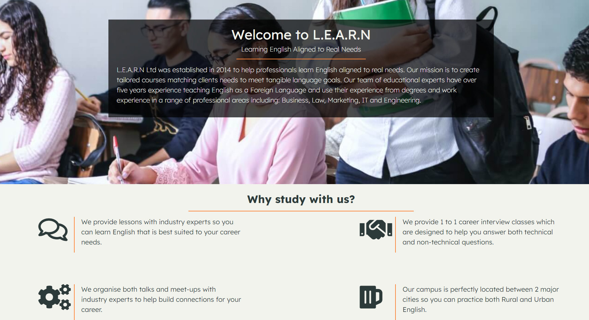
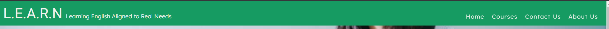
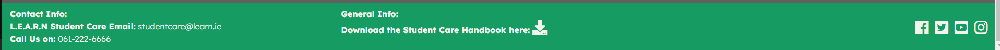
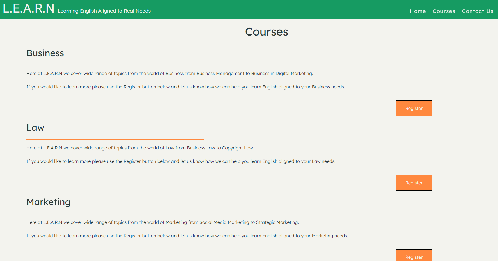
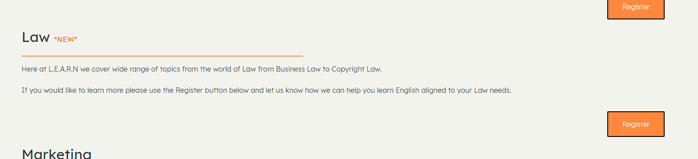
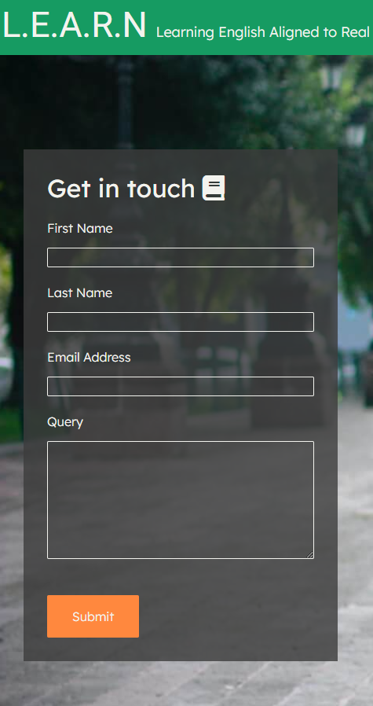
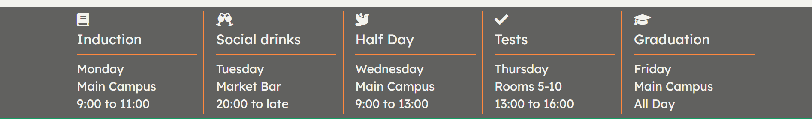

<h1 align="center">Testing</h1> 

## Code Validation
- #### HTML was validated using [validator.w3.org](https://validator.w3.org/). It views Font Awesome in heading tags 'h2' as empty tags and I had used an empty values tag in both my textarea's on the courses page and contact us page. Thankfully the about us page had no issues - The results can be found [index.html](images/home_page.png), [courses.html](images/courses_page.png), [contactus.html](images/contactus_page.png) and [aboutus.html](images/aboutus_page.png).
- #### CSS was validated using [jigsaw.w3.org](https://jigsaw.w3.org/css-validator/) please see the Bugs & Fixes section in the README for issues I had with CSS, thankfully I did not have any errors in the validation I did have errors in the implementation - The results can be found [here](images/css.png).
- #### Chromes Developer Tool Lighthouse, this tool highlighted that I was missing the Meta description tag from my site so I have updated the pages to contain this - The desktop audit results can be found [index.html](PDF/desktop_index.pdf), [courses.html](PDF/desktop_courses.pdf), [contactus.html](PDF/desktop_contactus.pdf) and [aboutus.html](PDF/desktop_aboutus.pdf).  The mobile audit results can be found [index.html](PDF/mobile_index.pdf), [courses.html](PDF/mobile_courses.pdf), [contactus.html](PDF/mobile_contactus.pdf) and [aboutus.html](PDF/mobile_aboutus.pdf). 

- #### Manual Testing was completed using Chrome, Edge, Firefox and Safari. Testing included the testing of all navigation links and the responsiveness of the site across these browsers. 

## Testing the User Experience (UX) stories

-   #### First Time Visitor Goals
    1. As a First Time Visitor, I want to easily understand the main purpose of the site and learn more about the school. As displayed in the image below, the user is greeted with the Mission mission statement of the Site and the main reasons to study with us.

    2. As a First Time Visitor, I want to be able to easily navigate throughout the site and to contact the support team for more information. As displayed in the images below, the navigation and footer which are located at the top and bottom of the page can be easily navigated to at any point in the website.

    3. As a First Time Visitor, I want to be able to find their social media links easily. As displayed in the image below, the social links will allows be available to the user in the Footer of the page.

    4. As a First Time Visitor, I want to be able to find their courses and sign up. As displayed in the images below, the user can navigate to the courses page at all times throughout the site.

-   #### Returning Visitor Goals
    1. As a Returning Visitor, I want to find information about new courses. As displayed in the image below, the user should be able to find any old and new courses from this page.

    2. As a Returning Visitor, I want to find the best / easiest way to get in contact with them with any query. As displayed in the images below, the user can use the contact us page or the contact info in the footer to get in touch with the team in multiple ways.

-   #### Frequent User Goals
    1. As a Frequent User, I want to check to see if there are any newly added courses or events. As displayed in the images below, The user can find new courses on the courses page and events will be displayed on the bottom of the index page.

    3. As a Frequent User, I want to be able to download the Student handbook if I need to. As displayed in the image below, the user can download the student handbook at anytime using the link provided in the footer of the site.
